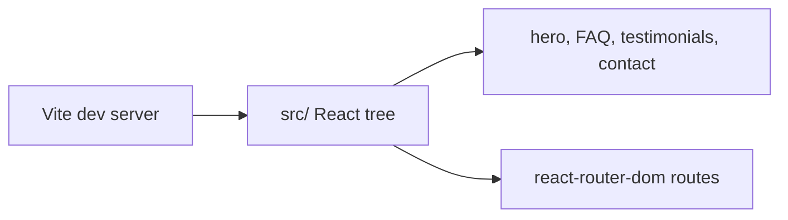

# PricedIn splash

Marketing landing page for PricedIn: hero, quotes, FAQ, and contact sections
built with React 19 and Vite. Static-friendly output suitable for CDN deploy.

## Architecture



## Development

```bash
npm install
npm run dev
npm run build
npm run preview
```

## Structure

| Path | Role |
| --- | --- |
| `src/hero.tsx` | Above-the-fold content |
| `src/FAQ.tsx` | Collapsible FAQ |
| `src/ContactForm.tsx` | Lead capture form UI |
| `public/` | Static assets |

## License

MIT
